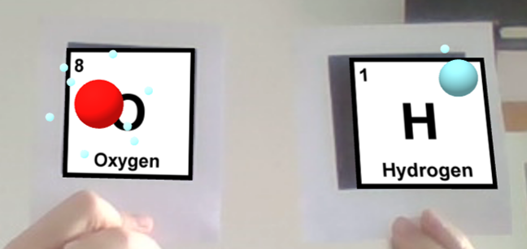
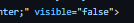

# Lesson: Interaction Design

### First and Last Name: Ευαγγελία Δεσποτίδου
### University Registration Number: dpsd19030
### GitHub Personal Profile: [Evedes01](https://github.com/Evedes01)
### Augmented Reality Personal Repository: [Evedes01's AR Repository](https://github.com/Evedes01/Augmented-Reality)

# Introduction

# Summary

# 1st Deliverable
Αρχικά κατέβασα το ATOM στο οποίο έκανα επεξεργασία τον κώδικα. Μέσα από το Α-Frame School βρήκα τον κώδικα για την σφαίρα και τον κύλινδρο και τον εφάρμοσα στον κώδικά μου. Άλλαξα τις τιμές για τα μεγέθη, τις θέσεις και τα χρώματα των σχημάτων. Έπειτα, από τα link που δίνονται στην περιγραφή/ζητούμενα του Deliverable 1, βρήκα και αντέγραψα τον κώδικα για το χιόνι και τις φωνητικές εντολές. Τοποθέτησα τον κώδικα των φωνητικών εντολών μέσα στον κώδικα του χιονιού, ώστε να ενεργοποιείται/απενεργοποιείται με τις φωνητικές εντολές "start" και "stop". Καθ'όλη τη διάρκεια της διαδικασίας είχα ανοιχτό στον Google Chrome το παράθυρο του index, το οποίο έκανα συνεχώς refresh, ώστε να βλέπω στην πράξη τις αλλαγές που έκανα στον κώδικα και αν λειτουργεί σωστά. όλες τις εντολές τις δοκίμασα με των φωτογραφία "Hiro" από το κινητό.

# 2nd Deliverable
Για το 2ο μέρος αυτής της εργασίας (Deliverable 2) ξεκίνησα από το ζητούμενο του Custom marker με βάση το dpsd. Έφτιαξα το περιεχόμενο του marker σε ένα πρόγραμμα ζωγρφικής (Krita), και έπειτα το ανέβασα στο [AR.js Marker Training](https://jeromeetienne.github.io/AR.js/three.js/examples/marker-training/examples/generator.html) για να φτιάξω τον marker.
 

 
 
Στη συνέχεια πήγα στον κώδικα και έβαλα τον marker με την εντολή <a-marker> μέσα στο <a-scene>, έθεσα τον τύπο του marker και το έκανα λινκ με το url στο patt αρχείο, ώστε να διαβάζει η κάμερα τον marker. Μετά έβαλα το κείμενο (το οποίο και μορφοποίησα με τις κατάλληλες εντολές που βρήκα [εδώ](https://aframe.io/docs/1.3.0/components/text.html)) και τη φωτογραφία (επίσης μορφοποιώντας με τις κατάλληλες εντολές. Τέλος τοποθέτησα και τα δύο στο κέντρο του marker με μια εντολή <a-entity>.
 

 
Δυστυχώς, στην αρχή δεν δούλεψε, καθώς αντιμετώπισα πρόβλημα με το CORS policy, οπότε δοκίμασα να αντικαταστήσω τον custom marker με τον hiro marker, όπου, αυτή τη φορά εμφανίστηκαν στην κάμερα μόνο τα γράμματα και ένα άσπρο τετράγωνο αντί της φωτογραφίας. Τελίκά, έλυσα το πρόβλημα χρησιμοποιώντας έναν local server, τον οποίο έκανα set-up με την βοήθεια της pyhton, και αφού βεβαιώθηκα ότι τα αρχεία δουλεύουν με το hiro marker ξανά έβαλα τον custom dpsd marker. Και έχει το εξής οπτικό αποτέλεσμα 
 
  
Για τους marker του υδρογόνου και του οξυγόνου ακολούθησα την ίδια διαδικασία με τον custom. Μέσα στους marker έχω καταχωρήσει τις αντίστοιχες οικόνες των στοιχείων και τα αντίστοιχα 3D μοντέλα σε glb format. Τα μοντέλα και το animation τα έφτιαξα στο Blender σύμφωνα με το [αυτό](https://www.youtube.com/watch?v=HfnMmN1nYYQ&t=647s&ab_channel=DerekElliott) το βίντεο.
  Παρακάτω είναι ο κώδικας για τα στοιχεία.
  

 
  
Για να λειτουργήσει το animation των 3D μοντέλων με την εντολή *animation-mixer* εισήγαγα το εξής [script](https://cdn.jsdelivr.net/gh/donmccurdy/aframe-extras@v6.1.1/dist/aframe-extras.min.js) στην αρχή του κώδικα και χρησιμοποιήσα τις εντολές που φαίνονται παρακάτω για να προσαρμώσω το animation (για αυτά τα βήματα συμβουλεύτηκα αυτήν τη [σελίδα](https://stackoverflow.com/questions/70735151/a-frame-pause-play-animation-mixer) και την σελίδα του A-Frame για τα animation 3D μοντέλων:
  
 
  
 
 Τέλος, προγραμμάτησα τον αλγόριθμο της απόστασης μεταξύ των markers με JavaScript σύμφωνα με αυτά τα links: [link1](https://stackoverflow.com/questions/61239107/how-to-get-marker-position-x-y-ar-js) και [link2](https://aframe.io/docs/0.8.0/introduction/writing-a-component.html). Επίσης, προσέθεσα το 3D μοντέλο του νερού στον marker του οξυγόνου, όπως και την κάρτα για το νερό, την οποία έφτιαξα στο Krita.
  
 
 
  
  Στα δύο προαναφερόμενα εφάρμωσα την εντολή *visible="false"*,  ώστε να είναι κρυφά στην αρχή και να εμφανίζονται μόνο όταν πληρείται η προϋπόθεση της απόστασης, που ορίζεται στον κώδικα JavaScript, ο οποίος είναι τοποθετημένος στο *body* πάνω από το *a-scene*.
  
  
 Το τελικό αποτέλεμα είναι το εξής:
  
 
 
# 3rd Deliverable 
Για αυτό το παραδοτέο, αρχικά, ασχολήθηκα με το Location-based. Πρώτα, έβαλα τις συντεταγμένες του μέρους που επέλεξα τις οποίες βρήκα από το Google maps (στην συγκεκριμένη περίπτωση πρόκειται για το Takayamaryu Shrine στην Ιαπωνία). Στη συνέχεια, και με τη βοήθεια ενός reference image σχεδίασα το 3D μοντέλο στο Blender και το έκανα export σε glb.
  

  
Προσέθεσα το μοντέλο στον κώδικα μαζί με τις σωστές συντεταγμένες και άλλαξα το *simulateLatitude* και το *simulateLongitude*, ώστε να έχουν μια μικρή διαφορά η τιμές από τις συντεταγμένες του το μοντέλου, για να μην βρίσκεται "μέσα" στο μοντέλο ο χρήστης και να μπορεί να το βλέπει μπροστά του.
  
 
  
 Επίσης, άλλαξα και τις τιμές *scale* και *rotation* για να προσαρμώσω το μέγεθος και τον προσανατολισμό του. Τέλος, του προσέθεσα animation, ώστε να περιστρέφεται.
  
 
  
 Το επόμενο βήμα ήταν να προσθέσω το κείμενο με τις πληροφορίες. Μετά από λίγο πειραματισμό με τις τιμές *scale* και *position* τοποθέτησα στη σωστή θέση το κείμενο.
  
 
  
 Σε επόμενη φάση έπρεπε να κρύψω το κείμενο και να το κάνω να εμφανίζεται μόνοο όταν πατιέται το 3D μοντέλο. Για να το επιτύχω αυτό συμβουλεύτηκα τις εξής σελίδες: [1](https://stackoverflow.com/questions/60814283/how-to-add-click-event-to-a-image-in-ar-js), [2](https://glitch.com/edit/?fbclid=IwAR3_dfesYnduw4w76z3izKgAyki91aWRjrXDdte4EAD0nkTAe0fhnoww4Q8#!/salty-partner-1?path=index.html%3A21%3A6). Έτσι, προσέθεσα τον JavaScript κώδικα μεταξύ του και *<head>* και του *<body>* και προσέθεσα τα ανάλογα ονόματα κλάσεων και τις εντολές στο *<a-text>* και το *<a-entity>* (glb model) 
  
 
 
 
  
 και συμπλήρωσα στο *text* την εντολή *visible="false"*, ώστε να είναι κρυφό πριν το πάτημα.
  
 
  
  
 Όσων αφορά το 3ο κομάτι αυτού του παραδοτέου, το Syros Location-based, ξεκίνησα αλλάζοντας τις συντεταγμένες στο σημείο που επέλεξα στη Σύρο και προστίθοντας αντί για το magnemite ένα κόκκινο κουτί για να δοκιμάσω αν λειτουργεί το location.
# Conclusions

# Sources
